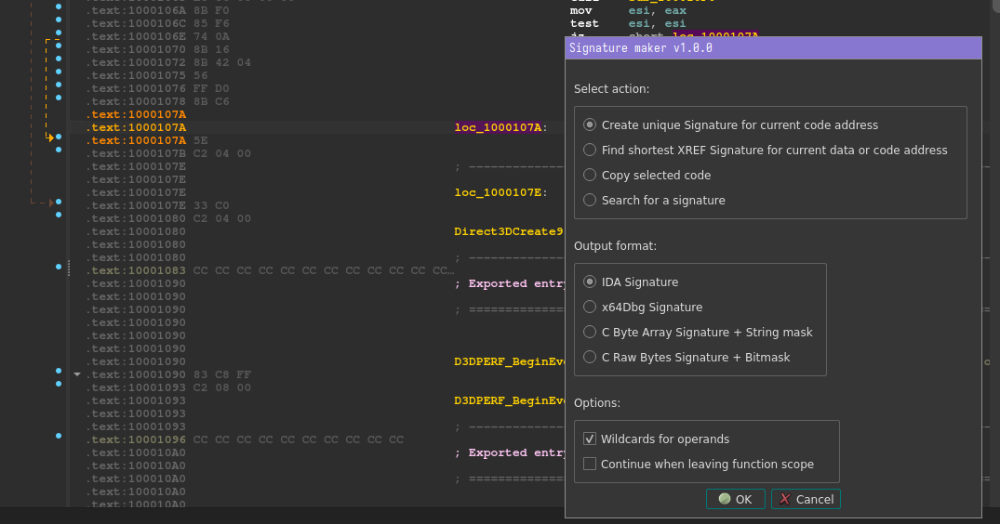
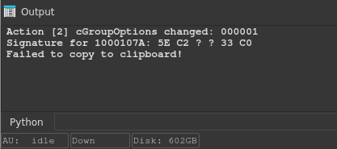
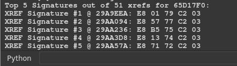
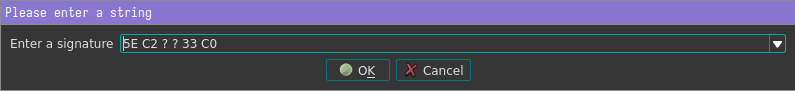
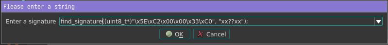
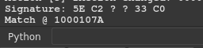

# ida-pysigmaker
A port of @A200K's [IDA-Pro-SigMaker](https://github.com/A200K/IDA-Pro-SigMaker) to IDA Python.

Signature Maker Plugin for IDA Pro 9.0
Should be cross platform.

## Requirements
- IDA Python
- Python 3

## Installation

```sh
cd ~/.idapro/plugins
wget https://raw.githubusercontent.com/elde-n/ida-pysigmaker/master/sigmaker.py
```

## Usage
In disassembly view, select a line you want to generate a signature for, and press
**CTRL+ALT+S**


The generated signature will be printed to the output console, as well as copied to the clipboard:


___

| Signature type | Example preview |
| --- | ----------- |
| IDA Signature | E8 ? ? ? ? 45 33 F6 66 44 89 34 33 |
| x64Dbg Signature | E8 ?? ?? ?? ?? 45 33 F6 66 44 89 34 33 |
| C Byte Array Signature + String mask | \xE8\x00\x00\x00\x00\x45\x33\xF6\x66\x44\x89\x34\x33 x????xxxxxxxx |
| C Raw Bytes Signature + Bitmask | 0xE8, 0x00, 0x00, 0x00, 0x00, 0x45, 0x33, 0xF6, 0x66, 0x44, 0x89, 0x34, 0x33  0b1111111100001 |

___
### Finding XREFs

Generating code Signatures by data or code xrefs and finding the shortest ones is also supported:


___
### Signature searching
Searching for Signatures works for supported formats:



Just enter any string containing your Signature, it will automatically try to figure out what kind of Signature format is being used:



Currently, all output formats you can generate are supported.

Match(es) of your signature will be printed to console:


